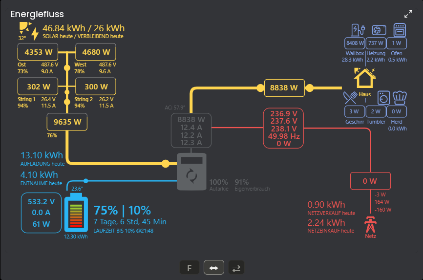
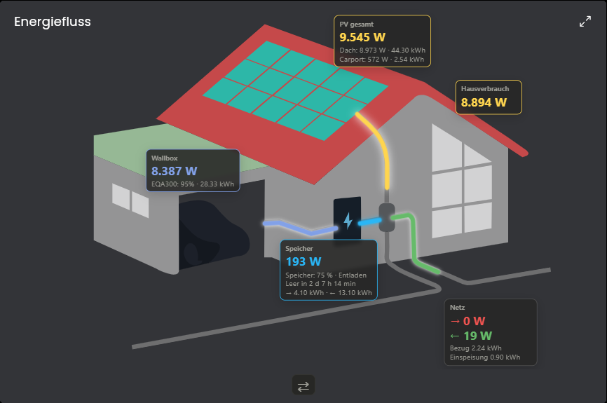

# ⚡ Energiefluss für IP-Symcon

Ein modernes Energieflussmodul für **IP-Symcon** zur Visualisierung von Energieflüssen in Echtzeit.

Das Modul kombiniert zwei vollständig integrierte Visualisierungen:

- ⚡ Technische Energieflussansicht
- 🏠 Grafische Hausansicht

Beide Ansichten können direkt innerhalb der Visualisierung umgeschaltet werden.

# ❤️ Verwendete Open-Source-Projekte

Dieses Modul integriert und erweitert zwei hervorragende Open-Source-Projekte für die Verwendung innerhalb von **IP-Symcon**.

## Third-Party Components

Dieses Modul verwendet folgende Open-Source-Komponenten:

| Komponente | Lizenz | Verwendung |
|------------|---------|------------|
| Sunsynk Power Flow Card | MIT | Technische Energieflussdarstellung (Compact, Lite, Full) |
| Power Flow Card (LordGuenni) | MIT | Hausgrafik |
| Lit (Google LLC) | BSD-3-Clause | Web Components Framework |

Die vollständigen Lizenztexte befinden sich im Verzeichnis `licenses/`.

Alle Rechte an den jeweiligen Drittkomponenten verbleiben bei deren ursprünglichen Autoren.

## 🏠 Power Flow Card

**Projekt:** https://github.com/LordGuenni/power-flow-card

- Grundlage der **Hausansicht**
- Ursprünglich für Home Assistant entwickelt
- Für IP-Symcon angepasst und lokal integriert
- **Lizenz:** MIT

---

## ⚡ Sunsynk Power Flow Card

**Projekt:** https://github.com/slipx06/sunsynk-power-flow-card

- Grundlage der **technischen Energieflussansicht**
- Ursprünglich für Home Assistant entwickelt
- Unterstützung der Ansichten **Lite**, **Compact**, **Full** sowie deren **Wide-Varianten**
- Für IP-Symcon angepasst und lokal integriert
- **Lizenz:** Apache License 2.0

---

Alle benötigten Dateien werden **lokal** mit diesem Modul ausgeliefert.

Es werden **keine externen CDN-Dateien** oder Internetverbindungen für die Visualisierung benötigt.

---

# ✨ Funktionen

Das Modul kombiniert zwei vollständig integrierte Visualisierungen:

- ⚡ Technische Energieflussansicht
- 🏠 Grafische Hausansicht

Beide Ansichten können direkt innerhalb der Visualisierung umgeschaltet werden.

---

## 📸 Screenshots

### Technische Energieflussansicht

### Hausansicht

---

## 🚀 Highlights

- ☀️ Bis zu **6 PV-Strings / PV-Eingänge**
- 🔧 **1 Wechselrichter**
- 🔋 Bis zu **2 Batteriespeicher**
- ⚡ Smart Meter
- 🚗 Wallbox mit Fahrzeug-SOC
- 🔌 Beliebig viele Verbraucher (automatische Anzeige der leistungsstärksten)
- 🎨 Frei konfigurierbare Farben
- 🎯 Frei wählbare Verbraucher-Icons
- 📊 Automatische Hausverbrauchsberechnung
- 🔮 Solarprognose
- 🌡️ Wechselrichtertemperatur
- 📱 Optimiert für Desktop, Tablet und Smartphone
- ⚡ Dynamische Energieflussanimation
- 📐 Lite-, Compact- und Full-Ansicht
- ↔️ Alle Ansichten zusätzlich als Wide-Version

---

## ⚙️ Funktionen

### ☀️ Photovoltaik

- Bis zu **6 PV-Strings / PV-Eingänge**
- aktuelle Leistung
- Energie
- Solarprognose
- Restproduktion des Tages

### 🔋 Batteriespeicher

- Bis zu **2 Batteriespeicher**
- Lade-/Entladeleistung
- SOC
- Lade- und Entladeenergie
- maximaler Entlade-SOC
- Restlaufzeit
- umkehrbare Flussrichtung

### ⚡ Smart Meter

Anzeige von

- Netzbezug
- Netzeinspeisung
- Bezug / Einspeisung gesamt
- Spannung L1/L2/L3
- Strom L1/L2/L3
- Netzfrequenz

### 🔧 Wechselrichter

Optional darstellbar:

- Gesamtleistung
- Temperatur
- Strom L1/L2/L3

### 🚗 Wallbox

- Ladeleistung
- Energie
- Fahrzeug-SOC
- frei konfigurierbarer Name

### 🔌 Verbraucher

Beliebig viele Verbraucher.

Pro Verbraucher:

- Name
- Leistung
- Energie
- Icon (IP-Symcon Iconbibliothek)
- Farbe

Die leistungsstärksten Verbraucher werden automatisch dargestellt.

---

## 🎨 Individualisierung

Konfigurierbar sind unter anderem:

- Farben aller Energieflüsse
- Farben der Hausgrafik
- Verbraucherfarben
- Wechselrichterfarbe
- Hausverbrauch
- Wallbox
- Flussgeschwindigkeit
- Icons der Verbraucher
- Layout der technischen Ansicht

---

## 📱 Responsive Design

Automatische Anpassung an

- Desktop
- Tablet
- Smartphone

mit optimierter Darstellung für alle Bildschirmgrößen.

---

## 🚀 Installation

1. Repository installieren
2. Instanz **Energiefluss** erstellen
3. PV konfigurieren
4. Batteriespeicher konfigurieren
5. Smart Meter konfigurieren
6. Wallbox (optional)
7. Verbraucher hinzufügen
8. Farben einstellen
9. Fertig

---

## 📦 Verwendete Open-Source-Projekte

Dieses Modul integriert folgende Open-Source-Projekte:

| Projekt | Verwendung | Lizenz |
|----------|------------|---------|
| LordGuenni / power-flow-card | Hausansicht | MIT |
| slipx06 / sunsynk-power-flow-card | Technische Energieflussansicht | Apache License 2.0 |

Beide Projekte wurden für IP-Symcon erweitert und vollständig lokal integriert.

Es werden **keine externen CDN-Dateien** benötigt.

---

## ❤️ Credits

Ein herzliches Dankeschön an

- **LordGuenni**
- **slipx06**

für die Entwicklung und Veröffentlichung ihrer hervorragenden Open-Source-Projekte.

---

## 📄 Lizenz

Dieses Projekt enthält Komponenten der folgenden Open-Source-Projekte:

- **power-flow-card** – MIT License
- **sunsynk-power-flow-card** – Apache License 2.0

Die jeweiligen Copyright- und Lizenzhinweise der Originalprojekte bleiben unverändert bestehen.