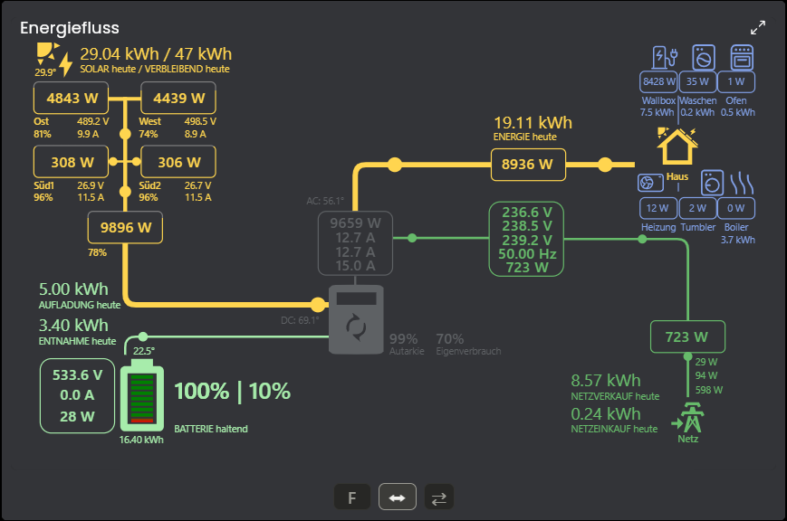
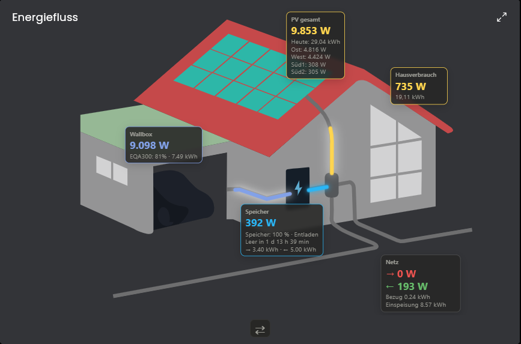
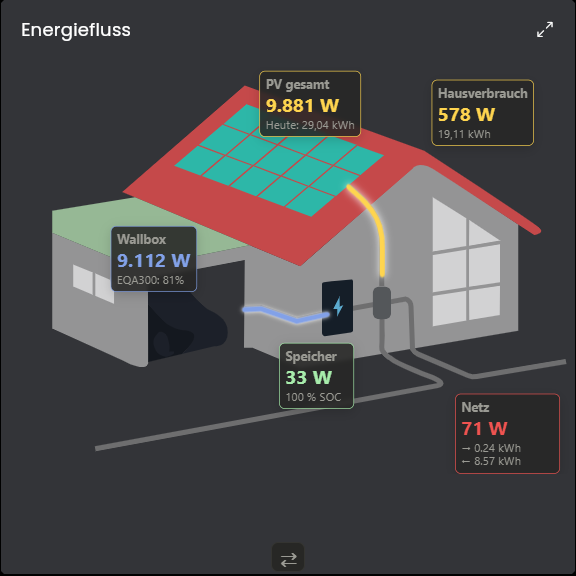

# ⚡ Energiefluss für IP-Symcon

Ein modernes Energieflussmodul für **IP-Symcon** zur Visualisierung von Energieflüssen in Echtzeit.

Das Modul kombiniert zwei vollständig integrierte Visualisierungen:

- ⚡ Technische Energieflussansicht
- 🏠 Grafische Hausansicht

Beide Ansichten können direkt innerhalb der Visualisierung umgeschaltet werden.

---

# ❤️ Verwendete Open-Source-Projekte

Dieses Modul integriert und erweitert folgende Open-Source-Projekte für die Verwendung innerhalb von **IP-Symcon**.

## Third-Party Components

| Komponente | Lizenz | Verwendung |
|------------|---------|------------|
| Sunsynk Power Flow Card | Apache License 2.0 | Technische Energieflussdarstellung |
| Power Flow Card (LordGuenni) | MIT | Hausgrafik |
| Lit (Google LLC) | BSD-3-Clause | Web Components Framework |

Die vollständigen Lizenztexte befinden sich im Verzeichnis `licenses/`.

Alle Rechte an den jeweiligen Drittkomponenten verbleiben bei deren ursprünglichen Autoren.

---

## 🏠 Power Flow Card

Projekt:

https://github.com/LordGuenni/power-flow-card

- Grundlage der Hausansicht
- Für IP-Symcon erweitert und lokal integriert
- Lizenz: MIT

---

## ⚡ Sunsynk Power Flow Card

Projekt:

https://github.com/slipx06/sunsynk-power-flow-card

- Grundlage der technischen Energieflussansicht
- Unterstützung der Ansichten Lite, Compact, Full sowie Wide
- Für IP-Symcon erweitert und lokal integriert
- Lizenz: Apache License 2.0

---

Alle benötigten Dateien werden lokal mit diesem Modul ausgeliefert.

Es werden **keine externen CDN-Dateien** oder Internetverbindungen benötigt.

---

# 📸 Screenshots

## Technische Energieflussansicht

## Hausansicht

## Hausansicht (Smartphone)

---

# ✨ Highlights

- ☀️ Bis zu 6 PV-Strings
- 🔧 Beliebig viele Wechselrichter mit Summenbildung
- 🔋 Bis zu 2 Batteriespeicher
- ⚡ Smart Meter
- 🚗 Wallbox mit Fahrzeug-SOC
- 🔌 Beliebig viele Verbraucher
- 📊 Automatische Berechnung von Hausverbrauch, Autarkie und Eigenverbrauch
- 🔮 Solarprognose
- 🌡️ AC- und DC-Temperatur des Wechselrichters
- 🎨 Frei konfigurierbare Farben
- 🎯 Frei wählbare Icons
- 📱 Optimiert für Desktop, Tablet und Smartphone
- ⚡ Dynamische Energieflussanimation
- 📐 Lite-, Compact-, Full- und Wide-Ansichten

---

# ⚙️ Konfiguration

## Allgemein

- Anzeige (Technische Ansicht / Hausgrafik)
- Layout (Lite / Compact / Full)
- Wide-Modus
- Flussgeschwindigkeit
- Farben
- Animationen

---

## ☀️ PV-Strings

Für jeden PV-String können folgende Werte konfiguriert werden:

- Name
- Leistungsvariable
- Spannung
- Strom
- Maximalleistung

Die Tages- und Gesamtenergie werden automatisch aus den Wechselrichtern übernommen.

---

## 🔧 Wechselrichter

Beliebig viele Wechselrichter können konfiguriert werden.

Pro Wechselrichter:

- Name
- Gesamtleistung
- Tagesenergie
- Gesamterzeugung
- AC-Temperatur
- DC-Temperatur
- Strom L1
- Strom L2
- Strom L3

Alle Werte werden automatisch summiert.

---

## 🔋 Batteriespeicher

Bis zu zwei Batteriespeicher.

Pro Batterie:

- Leistung
- Ladeleistung
- Entladeleistung
- Ladeenergie
- Entladeenergie
- State of Charge (SOC)
- Maximaler Entlade-SOC

---

## ⚡ Smart Meter

Konfigurierbar:

- Netzbezug
- Netzeinspeisung
- Tagesbezug
- Tageseinspeisung
- Spannung L1/L2/L3
- Strom L1/L2/L3
- Netzfrequenz

---

## 🚗 Wallbox

- Name
- Ladeleistung
- Energie
- Fahrzeug-SOC

---

## 🔌 Verbraucher

Beliebig viele Verbraucher.

Pro Verbraucher:

- Name
- Leistungsvariable
- Energie
- Icon
- Farbe

Automatische Anzeige der leistungsstärksten Verbraucher.

---

## 🎨 Darstellung

Konfigurierbar sind unter anderem:

- Farben aller Energieflüsse
- Farben der Hausgrafik
- Farben der Verbraucher
- Farben der Wallbox
- Wechselrichterfarbe
- Hausverbrauchsmodell
- Berechnung von Autarkie / Eigenverbrauch
- Flussgeschwindigkeit
- Icons
- Layout

---

# 📊 Berechnungen

Das Modul berechnet automatisch:

- Hausverbrauch
- Autarkie
- Eigenverbrauch
- Solarprognose
- Restproduktion des Tages
- Summen mehrerer Wechselrichter
- Summen mehrerer Batteriespeicher

Alle Berechnungen erfolgen vollständig innerhalb des Moduls.

---

# 📱 Responsive Design

Optimierte Darstellung für

- Desktop
- Tablet
- Smartphone

mit automatischer Skalierung der Visualisierung.

---

# 🚀 Installation

1. Repository installieren
2. Instanz **Energiefluss** erstellen
3. PV-Strings konfigurieren
4. Wechselrichter konfigurieren
5. Batteriespeicher konfigurieren
6. Smart Meter konfigurieren
7. Wallbox (optional)
8. Verbraucher hinzufügen
9. Darstellung anpassen
10. Fertig

---

# ❤️ Credits

Ein herzliches Dankeschön an

- LordGuenni
- slipx06
- Google LLC (Lit)

für die Veröffentlichung ihrer hervorragenden Open-Source-Projekte.

---

# 📦 Versionen

### Version 1.0
- Initiale Version

---

# 📄 Lizenz

Dieses Projekt steht unter der **MIT-Lizenz**.

Es enthält Komponenten der folgenden Open-Source-Projekte:

- Power Flow Card – MIT License
- Sunsynk Power Flow Card – Apache License 2.0
- Lit – BSD-3-Clause

Die jeweiligen Copyright- und Lizenzhinweise der Originalprojekte befinden sich im Verzeichnis `licenses/`.